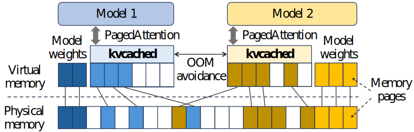
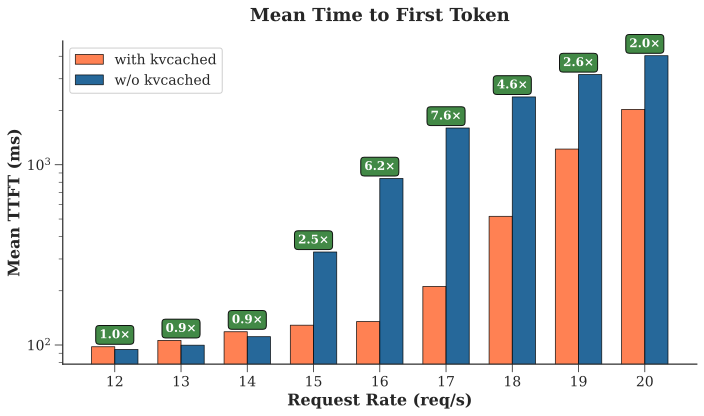
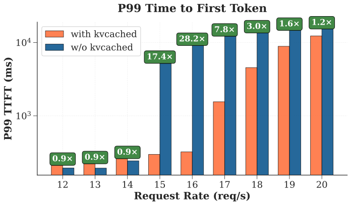

<div align="center">
  

  <br>
  <br>
  <p>
    <a href="https://www.python.org/"></a>
    
    <a href="LICENSE"></a>
  </p>

</div>

<h2 align="center">Virtualized Elastic KV Cache for Dynamic GPU Sharing and Beyond </h2>

kvcached is a new KV cache management system that enables **elastic KV cache** memory for autoregressive LLMs. It brings the benefits of **virtual memory** in operating systems to LLM serving: instead of statically reserving large blocks of GPU memory at startup (the common practice today), it allows serving engines to **allocate and release KV cache on demand** based on actual workload needs.

<p align="center">
  
</p>

<h3 align="left">Key Features</h3>

- 🔄 **Elastic KV cache**: allocate and reclaim KV memory dynamically to match live load.
- 🗺️ **GPU virtual memory**: decouple logical KV from physical GPU memory via runtime mapping.
- 🛠️ **Memory control CLI**: enforce memory limits with kvcached CLI.
- 🧭 **Frontend router and sleep manager**: route requests to the corresponding backend and put models to sleep when idle.
- 🤝 **Support SGLang and vLLM**: integrate with SGLang and vLLM.

<h3 align="left">Example use cases</h3>

- 🔀 **Multi‑LLM serving**: kvcached allows multiple LLMs to share a GPU's memory elastically, enabling concurrent deployment without the rigid memory partitioning used today. This improves GPU utilization and saves serving costs.
- ⚡ **Serverless LLM**: By allocating KV cache only when needed, kvcached supports serverless deployments where models can spin up and down on demand.
- 🧩 **Compound AI systems**: kvcached makes compound AI systems practical on limited hardware by elastically allocating memory across specialized models in a pipeline (e.g., retrieval, reasoning, and summarization).
- 🖥️ **GPU workload colocation**: kvcached allows LLM inference to coexist with other GPU workloads such as training jobs, fine-tuning, or vision models.

See concrete example here: [kvcached/examples](./examples).

## Performance: Dynamic memory sharing

kvcached enables dynamic memory sharing between LLMs, allowing them to share the same GPU memory elastically. As a comparison, the current serving engines need to statically reserve GPU memory at startup.

This benchmark shows the performance benefits of kvcached when serving three `Llama-3.1-8B` models on an A100-80G GPU under workloads with intermittent peaks. Details can be found in [benchmarks/bench_latency_benefit](./benchmarks/bench_latency_benefit).

<p align="center">
  
  
</p>

## Installation

### Prerequisites

- Python (tested with 3.9 - 3.12)
- PyTorch (compatible with SGLang and vLLM)

kvcached can be installed as a plugin with SGLang and vLLM.

```bash
cd engine_integration/scripts
# install kvcached with SGLang v0.4.9
./setup.sh --engine sglang --engine-method source --engine-version 0.4.9
# install kvcached with vLLM v0.9.2
./setup.sh --engine vllm --engine-method source --engine-version 0.9.2
```

This script will download the specified versions of SGLang and vLLM, create separate venv environments (using `uv`), compile the code, apply the necessary patches, and install kvcached.

## Run kvcached with Docker

You can test or develop kvcached with Docker.

To test kvcached with SGLang or VLLM.

```bash
docker pull ghcr.io/ovg-project/[kvcached-sglang|kvcached-vllm]:latest
```

For developmenet:

```bash
docker pull ghcr.io/ovg-project/kvcached-dev:latest
```

More instructions can be found [here](./docker/README.md).

## Testing

kvcached can be enabled or disabled by `export ENABLE_KVCACHED=true` or `false`. To verify the successful installation and benchmark the performance of SGLang/vLLM with kvcached, run:

```bash
cd benchmarks/simple_bench
export VENV_PATH=../../engine_integration/[sglang|vllm]-kvcached-venv
./start_server.sh [sglang|vllm] --venv-path $VENV_PATH --model meta-llama/Llama-3.2-1B
# Wait until LLM server is ready
./start_client.sh [sglang|vllm] --venv-path $VENV_PATH --model meta-llama/Llama-3.2-1B
```

The benchmark scripts automatically set `ENABLE_KVCACHED=true`. Please refer to each script for instructions on how to run SGLang/vLLM with kvcached.

## Memory monitoring and control via kvcached CLI

kvcached includes a built-in CLI tool that allows you to monitor GPU memory usage and manage memory limits across different applications. A command `kvctl` is installed along with kvcached package:

```bash
kvctl
```

Once inside the CLI, type `help` to view all supported commands:

```
kvcached> help
Available commands:
  list [ipc ...]               List IPC segments and usage
  limit <ipc> <size>           Set absolute limit (e.g. 512M, 2G)
  limit-percent <ipc> <pct>    Set limit as percentage of total GPU RAM
  watch [-n sec] [ipc ...]     Continuously display usage table
  kvtop [ipc ...] [--refresh r]  Launch curses kvtop UI (q to quit)
  !<shell cmd>                 Run command in system shell
  help                         Show this help message
  delete <ipc>                 Delete IPC segment and its limit entry
  exit | quit                  Exit the shell

kvcached>
```

Use the `kvtop` command for real-time visualization of memory usage:

<!-- KVCache memory monitor (muted colours) -->
<pre>
<span style="color:#009ACD; font-weight:bold;">KVCache Memory Usage</span>

<span style="color:#009ACD;">IPC: SGLANG</span>
<span style="color:#009ACD;">[</span><span style="color:#B7A800;">==</span><span style="color:#009E8F;">##################</span><span style="color:#666666;">----------------------------------------</span><span style="color:#009ACD;">]</span>
Prealloc: 792.0&nbsp;MB | Used: 11.2&nbsp;GB / 39.9&nbsp;GB (30.1%) | Free: 27.9&nbsp;GB

<span style="color:#009ACD;">IPC: VLLM</span>
<span style="color:#009ACD;">[</span><span style="color:#B7A800;">==</span><span style="color:#009E8F;">#######</span><span style="color:#666666;">--------------------------------------------------- </span><span style="color:#009ACD;">]</span>
Prealloc: 768.0&nbsp;MB | Used: 3.6&nbsp;GB / 37.4&nbsp;GB (11.7%) | Free: 33.0&nbsp;GB

<span style="color:#009ACD;">GPU Memory Usage</span>
<span style="color:#009ACD;">[</span><span style="color:#B7A800;">########################################</span><span style="color:#666666;">--------------------</span><span style="color:#009ACD;">]</span>
Used: 52.9&nbsp;GB / 79.2&nbsp;GB (66.8%) | Free: 26.3&nbsp;GB

<span style="color:#555555;">Press 'q' to quit</span>
</pre>

## Contributing

We are grateful for and open to contributions and collaborations of any kind.

We use pre-commit to ensure a consistent coding style. You can set it up by

```
pip install pre-commit
pre-commit install
```

Before pushing your code, please run the following check and make sure your code passes all checks.

```
pre-commit run --all-files
```

## Contacts

Feel free to contact us for contributions and collaborations.

```
Jiarong Xing (jxing@rice.edu)
Yifan Qiao (yifanqiao@berkeley.edu)
Shan Yu (shanyu1@g.ucla.edu)
```
